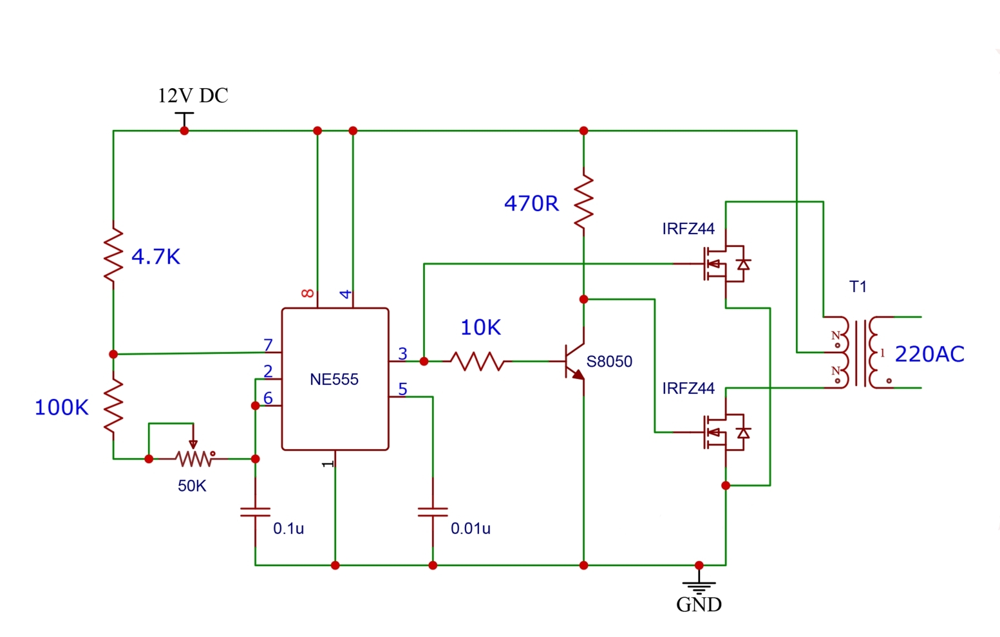

# 12V DC to 220V AC Inverter Using NE555 and IRFZ44 MOSFETs

This is a simple electronics project I built to convert a 12V DC supply into 220V AC using an NE555 timer, MOSFETs, and a transformer. The project includes the block diagram/schematic and the completed PCB board photo.

## Project Overview

The circuit uses an NE555 timer to generate switching pulses, a small transistor stage for driving, and two IRFZ44 MOSFETs to switch the transformer primary. The transformer steps the voltage up to 220V AC at the output.

## Materials Required

### Main Components and Their Use

- NE555 timer IC: Generates the switching pulse needed to drive the inverter.
- IRFZ44 MOSFET x 2: Acts as the main power switching device for the transformer primary.
- S8050 transistor: Works as a driver stage so the MOSFET gates can be controlled properly.
- Transformer: Steps the low-voltage 12V AC-style switching output up to 220V AC.

### Passive Components and Their Use

- 4.7K resistor: Helps bias the timing network and supports stable operation of the 555 timer.
- 100K resistor: Part of the timing circuit that helps set the oscillation frequency.
- 50K potentiometer: Lets the frequency be adjusted so the output can be tuned.
- 470R resistor: Limits current in the driver section and protects the control stage.
- 10K resistor: Helps control the base drive for the transistor stage.
- 0.1uF capacitor: Used in the timing network for stable oscillation.
- 0.01uF capacitor: Helps filter noise and stabilize the 555 timer control pin.

### Build Materials

- Perfboard or PCB: Used to mount and connect the circuit parts.
- Connecting wires: Used for routing power and output connections.
- 12V DC power source: Supplies the input power for the inverter.

## Why These Parts Are Used

Each component has a specific role in making the inverter work:

- The NE555 timer creates a repeating pulse signal.
- The transistor strengthens the timer output so the MOSFETs can be driven correctly.
- The MOSFETs switch the transformer quickly and efficiently.
- The transformer converts the low-voltage switching output into a higher AC voltage.
- The resistors and capacitors set timing, stability, and gate/base current control.
- The PCB or perfboard keeps the circuit physically organized and easier to assemble.

## Block Diagram / Schematic

## PCB Board

.png)

## Notes

- This is a basic homemade inverter project.
- The output voltage can be dangerous, so handle the circuit carefully.
- The final output depends on the transformer and component values used.
